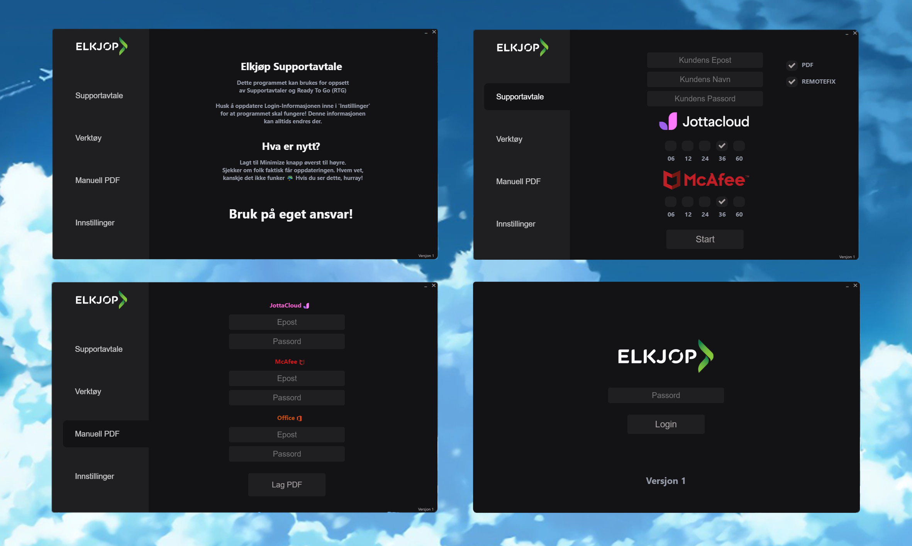

# Portable application for automating setups

Used for effectivizing employee workflow by automating tasks and centralizing tools

## Features  

* Web automation for account creation  
* Generate customizable PDFs with information  
* Run smaller scripts and files related to the setup  
* Frequent updates depending on feedback or bug report from the other employees  
* Encrypting data on portable device to provide consistency after updates  

Deprecated as of May 2023 when Elkjøp took a stance on self made scripts after being dormant on the issue

[![Electron][Electron.js]][Electron-url]
[![NodeJS][NodeJS]][Nodejs-url]
[![JS][JavaScript]][JavaScript-url]
[![Python][Python]][Python-url]
[![Rust][Rust]][Rust-url]

[NodeJS]: https://img.shields.io/badge/node.js-6DA55F?style=for-the-badge&logo=node.js&logoColor=white
[Electron.js]: https://img.shields.io/badge/Electron-191970?style=for-the-badge&logo=Electron&logoColor=white
[Electron-url]: https://electronjs.org/
[Nodejs-url]: https://nodejs.org/en/
[JavaScript]: https://img.shields.io/badge/javascript-%23323330.svg?style=for-the-badge&logo=javascript&logoColor=%23F7DF1E
[JavaScript-url]: https://www.javascript.com/
[Python]: https://img.shields.io/badge/python-3670A0?style=for-the-badge&logo=python&logoColor=ffdd54
[Python-url]: https://www.python.org/
[Rust]: https://img.shields.io/badge/rust-%23000000.svg?style=for-the-badge&logo=rust&logoColor=white
[Rust-url]: https://www.rust-lang.org/
